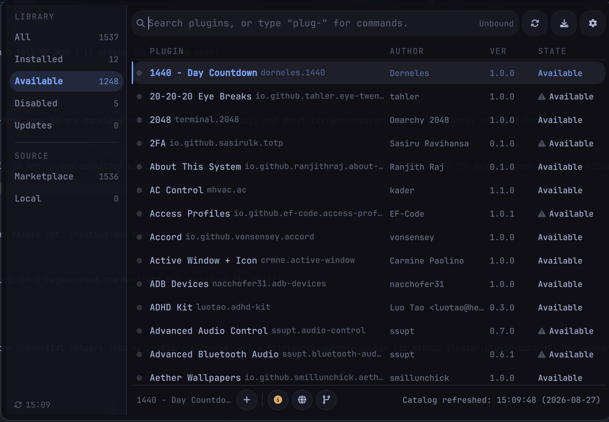
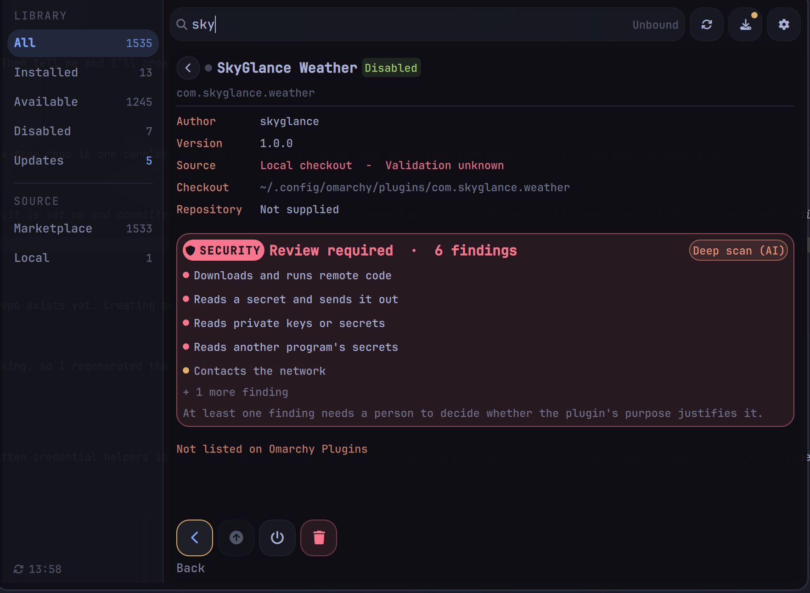

# Plugin Manager

A command-palette **plugin manager for Omarchy** with a built-in **security
scanner**. Browse, add, enable, disable, update and remove shell plugins from a
table UI — and see a static + optional AI security review of a plugin's code
*before* you enable or update it.



Omarchy plugins are unsandboxed QML loaded into your long-lived `omarchy-shell`
process: they run with your full permissions, at login, for as long as they
stay installed. Plugin Manager's job is to make what a plugin can *do* visible before it
runs.

## What it does

- **Table browser** — plugins in a real table (state · name · author · version)
  with a left rail of filters (All / Installed / Available / Disabled / Updates,
  and Marketplace / Local) that show live counts. `Ctrl+F` cycles them.
- **In-place detail** — selecting a plugin slides a detail view in over the
  table (no giant modal): metadata, actions as icons, and the security review.
- **Security review** — every time you open a plugin's detail, Plugin Manager statically
  scans its code and shows a verdict:

  

  - **No static findings** — nothing matched (not a clearance; see the caveat).
  - **Worth a look** — medium findings to eyeball.
  - **Review required** — high findings; enabling/updating asks you to type the
    action to confirm. Nothing is ever hard-blocked — the confirm *is* the
    override.

  Findings are shown as short one-liners (full explanation on hover): fetch-and-
  run, credential reads, cloud-credential access, obfuscation, persistence,
  command-injection seams, and a credential-read-**plus**-network-send "exfil"
  combo that fires regardless of destination.
- **Deep scan (AI)** — one click hands the plugin *and* the static report to
  your configured `omarchy agent` for a deeper review that can only *add*
  concern, never clear a finding.
- **Scans what an update brings** — updating fetches the incoming code to a
  throwaway worktree (never applied) and reviews the *diff* from your installed
  commit, so a plugin that was fine at install can't slip a change past you.

The scanner is honest about its limits: it reads source at one commit, so it
can't see runtime-assembled URLs, code fetched after install, dormant triggers,
or whether a capability is justified by the plugin's purpose. Every report ships
those limitations alongside the verdict.

## Install

```bash
omarchy plugin add https://github.com/the2dl/plugin-manager.git --enable
```

The security scanner needs `yara`, and `shellcheck` adds command-injection
detection (both optional — Plugin Manager degrades gracefully without them):

```bash
omarchy pkg add yara shellcheck
```

For a keyboard shortcut, add a binding to your `bindings.lua` (the plugin id is
unchanged from upstream for drop-in compatibility):

```lua
o.bind(
  "SUPER + P",
  "Plugin Manager",
  "omarchy-shell shell toggle io.github.ilyazar.plugin-control '{}'"
)
```

## Use

Plugin Manager opens from a local cache, no network or Git work. `Ctrl+r` refreshes
catalog and marketplace data.

Search by name, ID, description, author or tag; `Enter` opens the detail. The
filter rail narrows the list; the icon strip acts on the selected plugin
(update / enable / disable / remove, then info / website / source). Direct
commands still work too — type `plug-installed:`, `plug-add:`, `plug-update:`,
etc.

## Where this came from

Plugin Manager is a fork of **[ilyaZar/plugin-control](https://github.com/ilyaZar/plugin-control)**,
whose fast fuzzy command palette and clean plugin-lifecycle backend are the
foundation everything here is built on.

The security work took ideas from **[ksb.plugin-guard](https://omarchyplugins.com/)**
by Sergei Kartsev — another Omarchy security scanner — specifically its
logical-line joining (so a `curl \` + newline + `| sh` can't evade a rule) and
the rule that an AI pass may only raise a verdict, never lower it. The YARA
ruleset, the shellcheck pass, the exfil combo, and the UI gating are Plugin Manager's
own, tuned against the full marketplace so a clean plugin doesn't drown a real
finding in noise.

The plugin **id** stays `io.github.ilyazar.plugin-control` so Plugin Manager drops into
an existing install, and to keep the lineage honest.

## License

MIT, as upstream. See [LICENSE](LICENSE).
